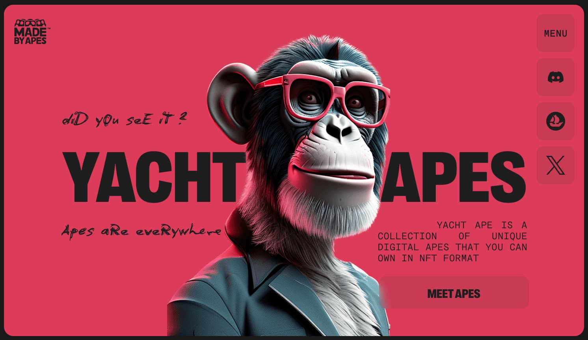
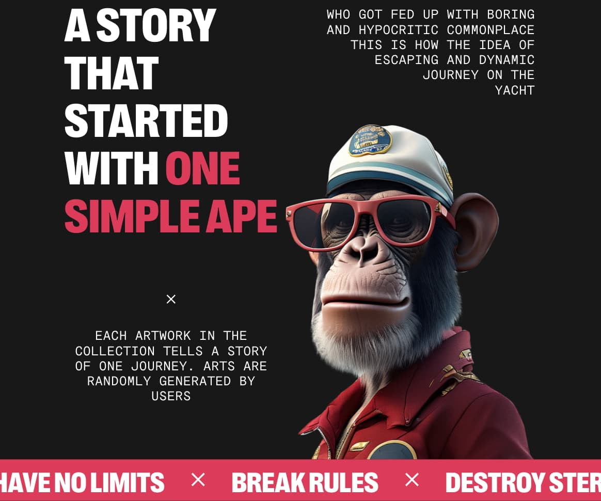
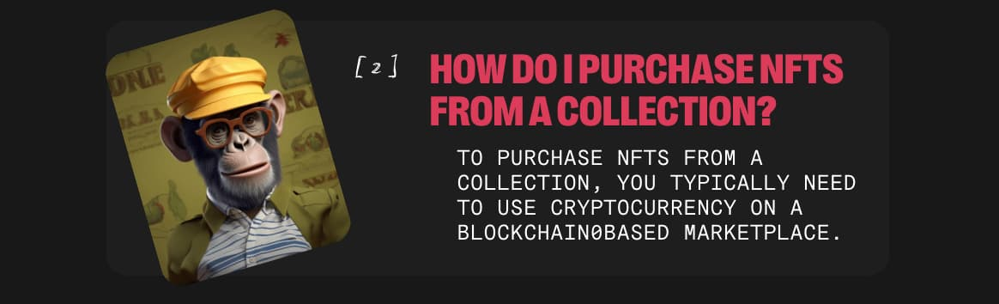
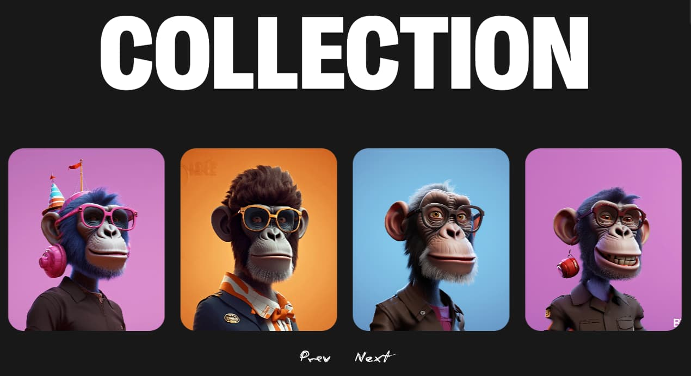

# YACHT APES

<h1 align="center">YACHT APES</h1>

Yacht Ape is a collection of unique digital apes that you can own in NFT format

## Overview

Yacht Ape offers a dynamic journey through a collection of unique digital apes. Each artwork in the collection tells a story of a different journey, randomly generated by users.

## Features

- **No Limits:** Break rules, destroy stereotypes.
- **Ownership Benefits:** All owners of Ape NFTs and future collections will
  receive a percentage of sales based on the number of NFTs they own.
- **Yape Drop:** Launch of the 2nd Yacht collection releasing the first version
  of the Ape Slam game.
- **New Collection:** Launch your own token, the proceeds of which will go to a
  global fund to launch Yacht Club and promote it.

## Frequently Asked Questions (FAQ)

- What is an NFT collection?
- How do I purchase NFTs from a collection?
- Can I sell or trade NFTs from a collection?
- What rights do I have as an owner of an NFT?

Answers to these and other questions, as well as plenty of other interesting
information, can be found in the web application. To learn more, click
[**HERE**](https://userandrii.github.io/ryzen_ape_nft/)

## Grand Collection

Targeted at expanding horizons and providing a unique experience, the grand
collections in Yacht Ape combine uniqueness with diversity. Each item in these
collections historically defines itself by its unique style and character,
inviting users on an unforgettable journey through the world of digital apes.
With the grand collection, you'll not only receive unique digital assets but
also have the opportunity to immerse yourself in an atmosphere of creativity and
imagination.

## Contributing

Are you in? [**Join**](https://userandrii.github.io/ryzen_ape_nft/) the Yacht
Ape community to be one of the first to receive our limited edition NFT.

## License

© Yacht Ape 2024. All rights reserved.

# Technologies and Dependencies

### React:

React is a JavaScript library for building user interfaces that allows you to
create dynamic and high-performing web applications. GooseTracks is based on
React, making it easy to create components and manage the application's state.

### Classnames:

Classnames is a utility library for conditionally joining classNames together.
It provides a simple way to conditionally apply CSS classes to elements in React
applications.

### Formik:

Formik is a popular form management library for React that simplifies the
process of building and validating forms. It provides a declarative way to
handle form state, validation, and submission, making it easier to build complex
forms in React applications.

### React Fast Marquee:

React Fast Marquee is a lightweight and fast marquee component for React
applications. It allows you to create horizontal or vertical scrolling content
with ease, making it ideal for showcasing dynamic content or advertisements.

### React Scroll:

React Scroll is a library for adding smooth scrolling functionality to React
applications. It provides a simple way to create scrollable elements and custom
scroll behavior, enhancing the user experience when navigating through a web
page.

### React Slick:

React Slick is a carousel component for React applications. It enables you to
create responsive and customizable carousels with smooth transitions and various
configuration options, making it easy to showcase multiple items in a compact
space.

### SASS:

SASS is a preprocessor scripting language that is interpreted or compiled into
CSS. It provides features like variables, nesting, and mixins, which help
streamline the process of writing and managing CSS stylesheets in large-scale
projects.

### TypeScript:

TypeScript is a typed superset of JavaScript that compiles to plain JavaScript.
It adds optional static typing and other features to the language, enhancing
code quality, readability, and maintainability, especially in larger codebases.

## Thank you for choosing us! Use it with pleasure!
